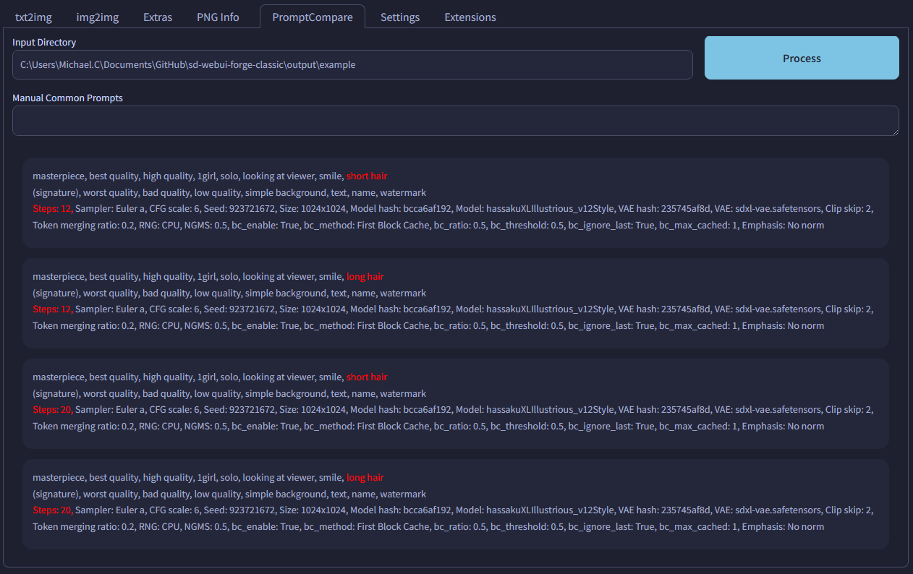

# SD Webui Prompt Comparison
This is an Extension for the [Automatic1111 Webui](https://github.com/AUTOMATIC1111/stable-diffusion-webui), which adds a new tab for prompt comparison.

> Compatible with [Forge](https://github.com/lllyasviel/stable-diffusion-webui-forge)

## How to Use
When given a folder, it will load the infotext for all images within that folder. Then, it will try to parse the common portion that is shared between all of them. You may also manually add certain words as common. Finally, it will list out all the infotext, with the differing parts highlighted in red.

This is mainly for comparison, where you want to ensure every image has the same parameters, with only the comparison target differing.
